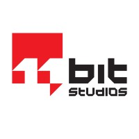

[![LinkedIn][linkedin-shield]][linkedin-url]

<!-- PROJECT LOGO -->

 
 

  
  
  <h3 align="center">Animation Programmer </h3>

  

  Recruitment Task
   

<!-- TABLE OF CONTENTS -->
## Table of Contents

* [Goals](#Goals)
* [Requirements](#Requirements)
* [Design](#Design)
* [UML]
* [Built With](#built-with)

<!-- Goals -->
## Goals

The main goal is to create a new Animation Graph node - one that would mirror the input pose across the XZ plane.

● By mirroring we mean that any transform that would be applied to a bone on the left
side of the skeleton should be flipped and applied to a corresponding bone on the
right. An animation showing a character moving their right hand should show them
moving their left hand instead.
 
 

● The task should be done in C++. New subclasses FAnimNode_Base and
UAnimGraphNode_Base should be created. These should be used in an Animation
Blueprint to demonstrate how the mirroring works.

<!-- Requirements -->
## Requirements

● The solution should be provided as an Unreal Engine project based on the
ThirdPerson_Cpp template, including C++ source code and an ABP graph showing
usage of the new Mirror node.
 
 

● The mirror node should work with the default UE4 mannequin and skeleton, as well
as the animations supplied with the sample.

● No third-party plugins should be used.

### Design behind mirroring node task
 
 Mirror Animations
To mirror skeletal animations two types of bones should be considered. Twin bones, which have their representation in antother Axis ( _l, _r ) like hands, arms, legs, foots and facial bones. And the other ones, which have no twin, like pelvis, spines, neck and head.

So to create a mirroring system, we have to define some meta data about the skeleton. The data is stored in Data_Asset class UData_MirrorTable.
It stores all twin bones in descending  order and also the name of the pelvis bone. To create new mirrortable you can use
AddNew -> or Miscellaneous->DataAsset->Data_MirrorTable.
There is already one created for default UE4 skeleton.
 
 
 

To mirror animations there is also needed config file in which we can specify which Axis we want to use for later reflection of the character.
For that purpose I have created Axis data asset config class named UData_AxisConfig. To create new axis config you can use
AddNew -> or Miscellaneous->DataAsset->Data_AxisConfig.
 
 

  

 Both references to data_Assets should be placed inside Anim instance class created for mirroring purposes or derived class.
 The base anim instance class is named UAnimInstance_Player. After creating the main animation class it should have below fields, setup them as in the image below.
 
 
 
 There is also an object class field called UAnimationMirrorObject that should be also specified as "Animation Mirror Object" like in the image above.
 It synchronize our config data ( mirror table and axis config ) from Anim Instance -> to the Anim Node which handles all the mirroring logic.
 The object is already setup to be created after AnimInstance initialization, so all you need to do is search it and connect to the mirror node.
 
 
 
 
 All mirroring logic is handled inside UAnimMirror_Node : FAnimNode_Base. 
 
 
 
 There is also UAnimGraphNode_Mirror_Base : UAnimGraphNode_Base which is the base class for any animation graph nodes 
 that is required for editor for AnimNode to work in runtime and being customized such as: color, tooltiptext.
 

<!-- Built With -->
## built-with
* [GitHub Emoji Cheat Sheet](https://www.webpagefx.com/tools/emoji-cheat-sheet)
* [Img Shields](https://shields.io)
* [Choose an Open Source License](https://choosealicense.com)
* [GitHub Pages](https://pages.github.com)
* [Animate.css](https://daneden.github.io/animate.css)
* [Loaders.css](https://connoratherton.com/loaders)
* [Slick Carousel](https://kenwheeler.github.io/slick)
* [Smooth Scroll](https://github.com/cferdinandi/smooth-scroll)
* [Sticky Kit](http://leafo.net/sticky-kit)
* [JVectorMap](http://jvectormap.com)
* [Font Awesome](https://fontawesome.com)

